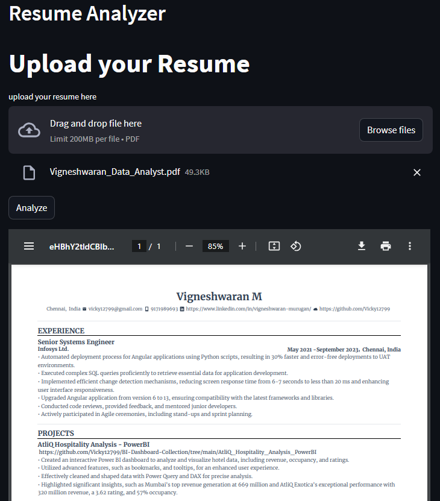

# Resume Analyzer and Summarizer Web Application

[](https://github.com/yourusername/resume-analyzer-summarizer-app/blob/main/LICENSE)

[](https://www.python.org/downloads/release/python-360/)

## Overview

The Resume Analyzer and Summarizer Web Application is a tool that allows users to upload their resumes in PDF format for automated analysis and summarization. This project combines image processing, natural language processing, and web development to offer a comprehensive solution for resume evaluation.




## Features

### Resume Analysis

- Extracts text from uploaded PDF resumes and segments them into relevant sections, including Experience, Education, Projects, Skills, and more.

### Information Extraction

- Utilizes natural language processing techniques to extract essential information such as the candidate's name, email address, and phone number.

### Career Role Classifier

- Predicts potential career role based on the skills and experience extracted from the resume.

### Text Summarization

- Summarizes the entire resume, making it easier for recruiters to quickly assess candidate qualifications.

### User-Friendly Interface

- Provides a user-friendly web interface built with Streamlit, allowing users to easily upload their resumes and view analysis results.

## Usage

To run the Resume Analyzer and Summarizer Web Application locally, follow these steps:

1. Clone the repository to your local machine:

   ```bash
   git clone https://github.com/Vicky12799/resume_analyzer.git
   ```

2. Install the required Python packages:

   ```bash
   pip install -r requirements.txt
   ```

3. Ensure you have Tesseract OCR installed and set up (refer to https://github.com/UB-Mannheim/tesseract/wiki).

4. Run the Streamlit application:

   ```bash
   streamlit run app.py
   ```

5. Open your web browser and access the application at http://localhost:8501.

6. Upload your resume in PDF format and click the "Analyze" button to view the analysis and summary.

## Setting Up Tesseract OCR

Before using this application, make sure you have Tesseract OCR installed and configured correctly. You can refer to the official [Tesseract OCR installation instructions](https://github.com/UB-Mannheim/tesseract/wiki) on their GitHub Wiki for detailed installation steps.

In your Python code, ensure that the `pytesseract.tesseract_cmd` variable points to the Tesseract executable as described in the Wiki. For example:

```python
pytesseract.pytesseract.tesseract_cmd = r"C:\\Program Files\\Tesseract-OCR\\tesseract.exe"
```

## Data Science and NLP Techniques

- Image processing with OpenCV for text extraction from PDFs.
- Natural Language Processing with spaCy for text analysis and information extraction.
- Transformers-based text summarization using the Hugging Face Transformers library.
- Machine learning model for career role classification based on resume content.

## Future Enhancements

This project is continuously evolving. Future enhancements may include:

- Improved accuracy in text extraction and segmentation.
- Support for various resume formats.
- Additional career insights and recommendations.

## License

This project is licensed under the MIT License - see the [LICENSE](LICENSE) file for details.

## Acknowledgments

- [Hugging Face Transformers](https://huggingface.co/models) for the pre-trained models.
- [Streamlit](https://www.streamlit.io/) for the user-friendly web interface.
- [spaCy](https://spacy.io/) for natural language processing capabilities.
